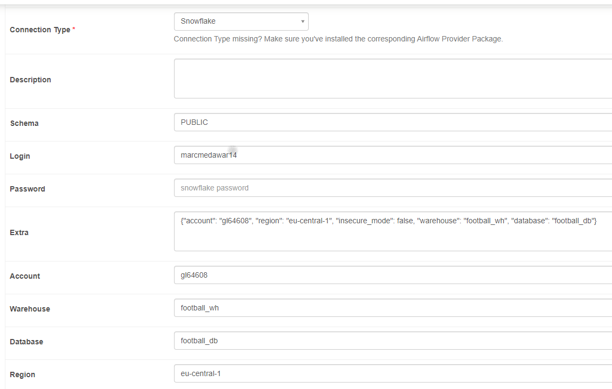

to start your project,
1. use the docker image in airflow/Dockerfile
2. build this  image. 
`docker build -t <image_name> .`
3. Start the Docker container:
`docker run -d --name my_airflow_container my-airflow:latest`

**add variable**  
add varilable manually in **airflow**,api_url, api_key, s3_bucket

**add connections** 

**start the extraction in python** define your DAG 