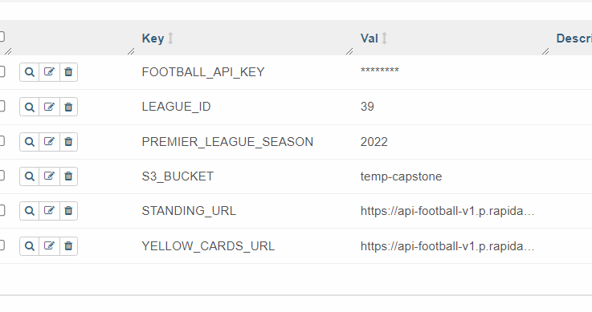
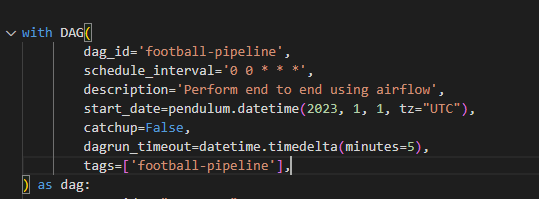

to start your project,
1. use the docker image in airflow/Dockerfile
2. build this  image. 
`docker build -t <image_name> .`
3. Start the Docker container:
`docker run -d --name my_airflow_container my-airflow:latest`

add  and  using the UI.

start the extraction in python.
define your 
