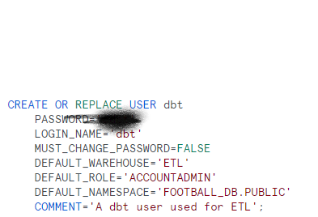
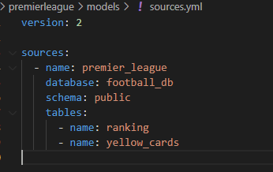
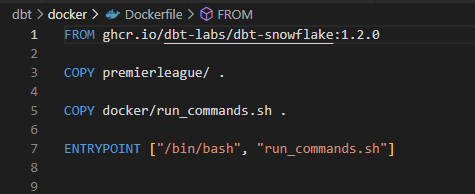
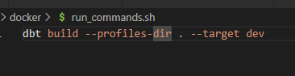

## DBT

we will use dbt to perform transformation on our data in snowflake,
dbt (data build tool) is a transformation tools that sits on top of our data warehouse.

We don't actually require any real transformation on our data; this is only for practice.

### Setup

1. Create a dbt user in snowflake 
2. Initialize a dbt repository: Run `dbt init` to create a new dbt repository. Enter your database details and your dbt role.
3. Create sources.yml to define your data sources. 
4. I am adding a basic singular test to check I will have erroneous data in my dashboard
5. Also I am adding an additional sources of data, the staduim capacity 
`dbt seed`
6. My transformation is basic such as extracting as join, change column name, extract latest value for ranking
7. Make sure the project  is working successfully `dbt build`, this cmd will execute everything except if you installed a new package.
8. Create a Dockerfile for your dbt project. This file will define the environment and dependencies required to run your dbt project inside a container. , 
9. Build your Docker image, push it to ECR, and create an ECS task definition using your image. Deploy the task definition to an ECS cluster.
10. In your Airflow DAG, use the ECS operator to run your dbt project.