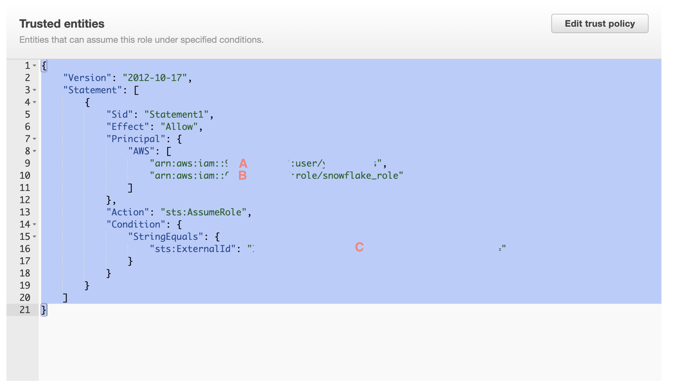

## Connecting S3 to Snowflake

Follow these steps to set up a connection between your S3 bucket and Snowflake:

### 1. Create Snowflake Database and Schema

Create a new database and schema in Snowflake:

```sql
CREATE DATABASE my_database;
CREATE SCHEMA my_schema;

GRANT USAGE ON DATABASE my_database TO ROLE s3_integration_role;
GRANT USAGE ON SCHEMA my_schema TO ROLE s3_integration_role;
GRANT CREATE TABLE ON SCHEMA my_schema TO ROLE s3_integration_role;
GRANT CREATE STAGE ON SCHEMA my_schema TO ROLE s3_integration_role;
GRANT CREATE STORAGE INTEGRATION ON ACCOUNT TO ROLE s3_integration_role;

USE ROLE s3_integration_role;
CREATE STORAGE INTEGRATION s3_integration
TYPE = EXTERNAL_STAGE
STORAGE_PROVIDER = S3
ENABLED = TRUE
STORAGE_ALLOWED_LOCATIONS = ('s3://your-bucket-name/');

DESC STORAGE INTEGRATION s3_integration; -- Note down the STORAGE_AWS_ROLE_ARN value.

CREATE STAGE my_schema.my_stage
URL = 's3://your-bucket-name/'
STORAGE_INTEGRATION = s3_integration;
```
Update trust policy in your role to grant Snowflake role access to the S3 bucket 
