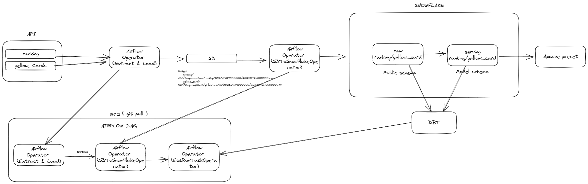

## Premier League ETL Pipeline

In this project I will date provided from [rapid-API](https://rapidapi.com/hub) for the premier league (highest level of the English football league system)
The output will be reports that provide insights on Premier League data.

### Motivation
This project was inspired by an interest in data engineering and the latest concept used in the field, such as idempotence. It also an opportunity to develop skills and gain experience with a range of tools, such as Snowflake for creating infrastructure and deploying Airflow on an EC2 instances. The project is more complex than required, utilizing dbt, Snowflake, Airflow, Docker, AWS, and CI.

### Architecture 

1. Extract data using the [football API](https://rapidapi.com/api-sports/api/API-FOOTBALL)
2. Load into [AWS S3](https://aws.amazon.com/s3/)
3. Copy into [snowflake](https://www.snowflake.com/en/)
4. Transform using [dbt](https://www.getdbt.com/)
5. create [docker](https://www.docker.com/) image and deploy it on AWS [ECS](https://aws.amazon.com/ecs/)
6. Create [PowerBI](https://powerbi.microsoft.com/en-gb/) Dashboard
7. Orchestrate with [Airflow](https://airflow.apache.org/) on [EC2](https://aws.amazon.com/ec2/)

## output
add image 1

### setup:

Follow below steps to setup pipeline. I've tried to explain steps where I can. 

All the services I am using on AWS free tier account,  the only thing I paid for running airflow on EC2 + when storing my image on ECR ( 0.10c/ month ) or keeping your infrastrcutre for a long period of time.

1. [get airflow locally](instructions/airflow_local.md) 
2.  [Rapid-API configuration](instructions/Rapid_API_configuration.md)
3.  AWS account
    configure my role for snowflake
    loading file into s3
    s3 role with the policy and trust policy
4. CI
5. docker
    dbt core
    built the airflow image locally
    built the image EC2
6. snowflake 
    create all these role, storage integration, table, database, schema
    create stage
    storage integration
7. dbt
    singular test,
    I make sure I only have 20 rows also
    dbt seed for my image 
    change column name 
    extract latest value for today
8. dashboard
9. notes
10. imorovement
    I didnt create specific role in snowflake, RBAC
    the s3 steps is optional but I wanted to load data from s3 to snowflake
    use CD to create ressouces in snowflake

I will demonstarte the concept of idempotence when running 

add varilable manually in airflow
api_url
api_key
s3_bucket
s3_bucket

add connection manually in airflow to connect to s3

we are downloading 2 data sources for our porject

Yellow_card link
ranking

